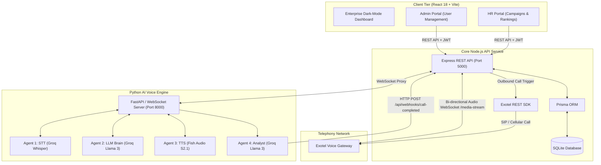
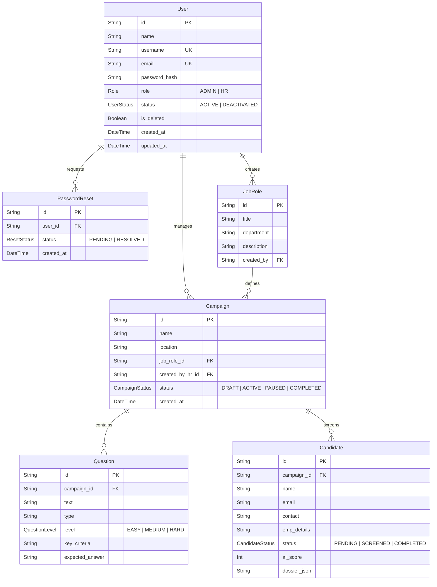
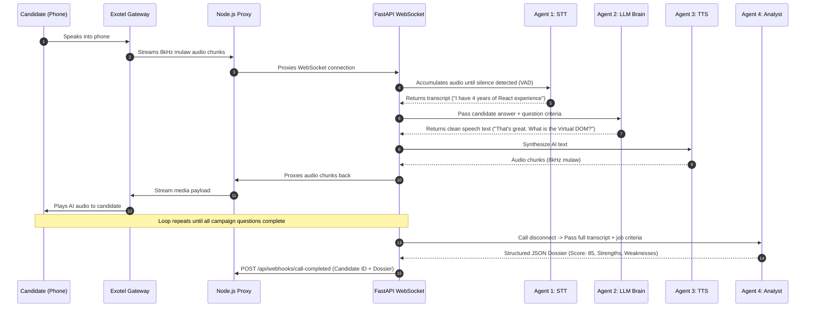
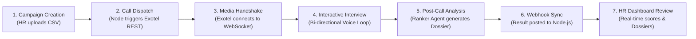

# AntiTalk Platform: System Architecture, Data Models & Flow Summary

## Executive Summary & System Purpose

**AntiTalk** is a multi-agent, B2B SaaS platform designed to automate high-volume recruitment screening through real-time AI voice phone calls. 

### The Problem
Traditional recruitment workflows require HR teams to spend hundreds of hours conducting routine preliminary phone interviews. This process creates hiring bottlenecks, increases operational costs, introduces human interviewer bias, and delays response times for candidates.

### The Solution
AntiTalk deploys autonomous AI Voice Interviewers that conduct initial technical and behavioral phone screenings at scale. The platform provides:
* **Automated Outbound Calling**: HR uploads a CSV candidate roster and initiates simultaneous AI calls via Exotel.
* **Real-Time Interactive AI Voice Interview**: Powered by a multi-agent Python service combining Groq Whisper STT, Groq Llama 3 LLM decision-making, and Fish Audio TTS with Voice Activity Detection (VAD) and barge-in capability.
* **Instant Candidate Dossier & Scoring**: Immediately after each call, an AI Analyst synthesizes the complete interview transcript into a structured candidate dossier with an AI score (0–100), key strengths, weaknesses, and full transcript logs.

---

## 🏗️ System Architecture & Tech Stack

AntiTalk uses a 3-tier microservice architecture separating web management, business logic/telephony orchestration, and computationally heavy Machine Learning voice processing.



### Technology Stack Overview

| Component | Stack / Technologies | Primary Responsibility |
| :--- | :--- | :--- |
| **Frontend** | React 18, Vite, Tailwind CSS, Lucide Icons, Framer Motion | Enterprise UI for Admin & HR management, CSV candidate upload, real-time candidate dossiers |
| **Backend Core** | Node.js, Express.js, Prisma ORM, SQLite | Auth (JWT), RBAC, campaign orchestration, DB persistence, Exotel call dispatch & webhooks |
| **AI Voice Service** | Python 3.10+, FastAPI, WebSockets, asyncio | Bi-directional streaming audio processing, VAD, multi-agent evaluation pipeline |
| **Speech-to-Text (STT)** | `Groq Whisper` | Real-time audio stream transcription |
| **LLM Brain & Analyst** | `Groq Llama 3` | Conversational interview state machine & post-call dossier generation |
| **Text-to-Speech (TTS)** | `Fish Audio S2.1` | Low-latency audio synthesis formatted for Exotel 8kHz $\mu$-law streams |
| **Telephony Gateway** | Exotel Voice API, Webhooks, WebSockets | Initiating phone calls and streaming raw candidate audio |

---

## 📊 Data Models & Database Schemas

The database schema is defined using Prisma ORM in `server/prisma/schema.prisma` and stored in an SQLite database.



### Detailed Entity Descriptions

1. **User Model** (`server/prisma/schema.prisma`)
   - Stores account credentials, roles (`ADMIN` or `HR`), and soft-deletion flags.
2. **PasswordReset Model** (`server/prisma/schema.prisma`)
   - Handles administrative password reset workflows for HR staff.
3. **JobRole Model** (`server/prisma/schema.prisma`)
   - Defines reusable job templates (title, department, technical description).
4. **Campaign Model** (`server/prisma/schema.prisma`)
   - Represents a specific hiring drive. Links a job role with HR managers, interview questions, and candidates.
5. **Question Model** (`server/prisma/schema.prisma`)
   - Questions associated with a campaign. Contains structured evaluation guidelines: `key_criteria`, `expected_answer`, and difficulty level.
6. **Candidate Model** (`server/prisma/schema.prisma`)
   - Individual applicants under a campaign. Stores candidate contact details, screening status (`PENDING`, `SCREENED`, `COMPLETED`), numerical `ai_score` (0–100), and serialized JSON dossier output.

---

## 🤖 Multi-Agent AI Voice Engine Architecture

The AI engine in `python_service` is structured into four autonomous sub-agents located in `python_service/agents`:

```
python_service/agents/
├── stt_agent.py              # Agent 1: Speech-to-Text (Groq Whisper)
├── llm_agent.py              # Agent 2: Conversation Manager & Brain (Groq Llama 3)
├── tts_agent.py              # Agent 3: Text-to-Speech (Fish Audio / Edge TTS)
└── ranker_agent.py           # Agent 4: Analyst & Dossier Generator (Groq Llama 3)
```



### Agent Roles & Operational Rules

1. **Agent 1: STT Agent (`Groq Whisper`)** (`python_service/agents/stt_agent.py`)
   - Transcribes raw audio frames into clean English text.
2. **Agent 2: LLM Brain (`Groq Llama 3`)** (`python_service/agents/llm_agent.py`)
   - Manages conversational flow state across campaign questions.
   - **Evaluation & Re-ask Logic**: Evaluates candidate answers against the question's `key_criteria`. If an answer is vague or incomplete, it politely asks a clarifying follow-up question (capped at 1 attempt per question before moving on).
   - **Voice-Only Output Sanitization**: Strips markdown syntax, asterisks, bullet points, and internal thought chains to output clean, conversational spoken text.
3. **Agent 3: TTS Agent (`Fish Audio`)** (`python_service/agents/tts_agent.py`)
   - Converts AI response text into 8kHz $\mu$-law audio payload format required by Exotel WebSocket media streams.
4. **Agent 4: Analyst / Ranker Agent (`Groq Llama 3`)** (`python_service/agents/ranker_agent.py`)
   - Executes post-call evaluation on complete transcript. Parses qualitative feedback into a structured JSON schema:
     ```json
     {
       "score": 85,
       "summary": "Strong technical background in React and Node.js...",
       "strengths": ["Clear communication", "In-depth understanding of state management"],
       "weaknesses": ["Limited hands-on experience with Microservices testing"]
     }
     ```

---

## 🔄 End-to-End Execution Flow

The complete lifecycle of an AI recruitment campaign operates in 7 distinct steps:



### Detailed Workflow Step-by-Step

1. **Campaign Creation & Candidate Batching**:
   - HR logs into the React frontend (`client/src/components/hr/HrDashboard.jsx`), defines a job role, configures interview questions with `key_criteria`, and uploads a candidate CSV.
   - The frontend parses the file using `PapaParse` and sends the payload to `server/controllers/hrController.js`, persisting the records to SQLite via Prisma.

2. **Call Dispatch**:
   - HR clicks "Launch Campaign".
   - The Node backend calls the Exotel API in `server/controllers/telephonyController.js` for pending candidates.

3. **Media Handshake**:
   - Exotel initiates the call and connects to the Node.js WebSocket endpoint `/media-stream`.
   - Node.js proxies the raw binary stream transparently to the Python FastAPI server.

4. **Real-time Bi-directional Interview Loop**:
   - The Python service (`python_service/main.py`) receives the stream.
   - Voice Activity Detection (VAD) monitors incoming audio stream energy (RMS thresholding) alongside Echo Cancellation logic.
   - Once silence is detected, the audio buffer is passed to STT $\rightarrow$ LLM Brain $\rightarrow$ TTS $\rightarrow$ streamed back to Exotel.
   - **Barge-in Support**: If the candidate interrupts while the AI is speaking, the server cancels the current TTS task and resets the audio stream.

5. **Post-Call Analysis**:
   - Upon WebSocket disconnection (hangup), `RankerAgent` receives the full interview transcript.
   - The agent evaluates technical proficiency against campaign goals and generates a structured candidate dossier.

6. **Webhook Synchronization**:
   - The Python service sends an HTTP `POST` request to `/api/webhooks/call-completed` in Node.js via `python_service/utils/webhook_client.py`.
   - Node updates the Candidate record in SQLite with `status: SCREENED`, `ai_score`, and `dossier_json`.

7. **HR Review & Decisioning**:
   - HR views live updating candidate rankings on the React frontend.
   - Clicking "View Dossier" displays candidate scores, summary metrics, strengths, weaknesses, and complete transcript logs.

---

## 📁 Key File Map & Code Organization

### Backend Service (`/server`)
- **`server/server.js`**: Entry point setting up Express app, WebSocket Proxy, and route mounting.
- **`server/prisma/schema.prisma`**: Database models, relationships, and enums.
- **Routes**:
  - `server/routes/authRoutes.js`: Login & authentication routes.
  - `server/routes/adminRoutes.js`: User management and system setting routes.
  - `server/routes/hrRoutes.js`: Campaign, job role, and candidate management routes.
  - `server/routes/telephonyRoutes.js`: Outbound logic and Exotel call webhooks.
- **Controllers**:
  - `server/controllers/authController.js`
  - `server/controllers/adminController.js`
  - `server/controllers/hrController.js`
  - `server/controllers/telephonyController.js`

### Python AI Voice Engine (`/python_service`)
- **`python_service/main.py`**: FastAPI entry point managing WebSockets `/media-stream` and VAD.
- **Agents**:
  - `python_service/agents/stt_agent.py`: Groq Whisper STT.
  - `python_service/agents/llm_agent.py`: Groq Llama 3 Interview Brain.
  - `python_service/agents/tts_agent.py`: Fish Audio TTS.
  - `python_service/agents/ranker_agent.py`: Dossier & Scoring Analyst.
- **Testing (`agent_test/`)**:
  - `agent_test/main.py`: Fully interactive UI browser sandbox test app.

### Frontend Client (`/client`)
- **`client/src/App.jsx`**: Main router & layout configuration.
- **`client/src/services/api.js`**: Centralized Axios instance with automatic JWT authorization header injection.
- **Components**:
  - `client/src/components/hr/HrDashboard.jsx`: HR campaign overview & rankings table.
  - `client/src/components/layout/DashboardLayout.jsx`: Sidebar layout for authenticated portals.

---

## 🛠️ Verification & Operational Guidance

### Running Local Development Environment

1. **Database Setup**:
   ```bash
   cd server
   npx prisma db push
   node seed.js
   ```

2. **Start Node Backend & React Frontend**:
   ```bash
   # From project root
   npm run dev
   ```

3. **Start Python AI Voice Engine**:
   ```bash
   cd python_service
   .\venv\Scripts\python.exe -m uvicorn main:app --host 0.0.0.0 --port 8000 --reload
   ```

4. **Ngrok Tunnel (For Telephony Webhooks)**:
   ```bash
   ngrok http 5000
   ```
   *(Only 1 tunnel is needed on port 5000 since Node.js handles the WebSocket Proxy).*

5. **Interactive Web UI Sandbox (Testing)**:
   To test the AI interview flow without initiating real phone calls or Exotel infrastructure, use the browser sandbox:
   ```bash
   cd agent_test
   ..\python_service\venv\Scripts\python.exe -m uvicorn main:app --port 8005 --reload
   ```
   *Open `http://localhost:8005` in your browser.*
