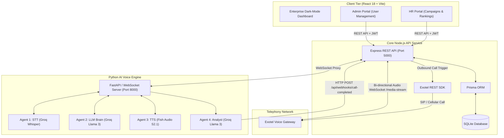
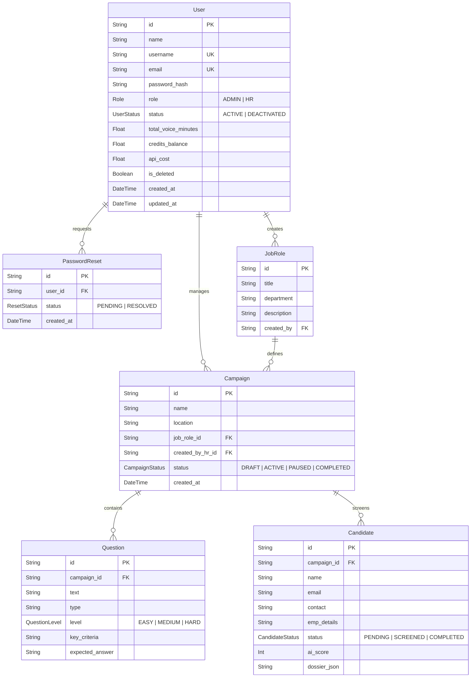
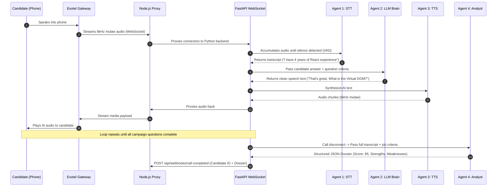
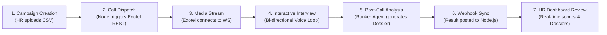

# AntiTalk Platform: Comprehensive Architecture & System Documentation

## Executive Summary & System Purpose

**AntiTalk** is an enterprise-grade multi-agent B2B SaaS platform engineered to revolutionize the recruitment pipeline. By leveraging real-time, autonomous AI voice agents over telephony streams, AntiTalk automates initial candidate phone screenings, allowing HR departments to scale their hiring efforts exponentially while maintaining a high bar for technical evaluation.

### Key Business Impact
- **Massive Scalability**: Recruiter launches campaigns for hundreds of candidates simultaneously with a single CSV upload.
- **Unbiased & Standardized Screenings**: Candidates receive identical technical evaluations and non-judgmental interactions.
- **Product-Led Growth (PLG) Ready**: Integrated credit billing system tracks usage limits and gracefully upsells HR users via an automated funnel when trial credits deplete.
- **Instant Quantitative & Qualitative Analytics**: HR receives an AI score (0–100), full interview transcripts, and parsed dossiers outlining candidate strengths and weaknesses immediately upon call termination.
- **Human-in-the-Loop QA**: HR maintains final authority with the ability to review interactive chat transcripts and manually override AI evaluations.

---

## 🏗️ System Architecture & Tech Stack

AntiTalk uses a 3-tier microservice architecture separating web management, business logic/telephony orchestration, and computationally heavy Machine Learning voice processing.



### Technology Stack Breakdown

| Layer | Stack / Technologies | Key Responsibilities |
| :--- | :--- | :--- |
| **Frontend Application** | React 18, Vite, Tailwind CSS, Lucide Icons, Framer Motion | Provides dark-mode management UI for Admin & HR portals, candidate CSV uploading, live rankings, Upsell funnels, and interactive dossier popups |
| **Backend Core** | Node.js, Express.js, Prisma ORM, SQLite, Zod | Auth (JWT), RBAC, campaign orchestration, input validation, DB persistence, Exotel call dispatch & webhooks, call billing (PLG credits algorithm) & accounting |
| **AI Engine Server** | Python 3.10+, FastAPI, Uvicorn, WebSockets | Streams bi-directional 8kHz $\mu$-law audio over WebSockets with Voice Activity Detection (VAD) and barge-in capability |
| **Speech-to-Text (STT)** | `Groq Whisper API` | Real-time transcription of incoming candidate voice audio |
| **LLM Brain & Analyst** | `Groq Llama 3 API` | Conversational interview state machine (evaluating criteria, handling re-asks) & post-call dossier analyst |
| **Text-to-Speech (TTS)** | `Fish Audio API` / `Edge TTS` | Low-latency synthesis of AI response text back into telephony-compatible audio streams |
| **Telephony Gateway** | Exotel Voice API | Connects cellular/landline phone networks with server WebSockets via custom call flow |

---

## 📊 Data Models & Schema Architecture

All application persistence is handled via Prisma ORM in `server/prisma/schema.prisma` backed by an SQLite database.



---

## 🤖 Multi-Agent AI Engine Architecture

Located in `python_service/agents`, four specialized AI agents collaborate during and after the interview:

```
python_service/agents/
├── stt_agent.py              # Agent 1: Speech-to-Text (Groq Whisper)
├── llm_agent.py              # Agent 2: Conversation Manager & Brain (Groq Llama 3)
├── tts_agent.py              # Agent 3: Text-to-Speech (Fish Audio / Edge TTS)
└── ranker_agent.py           # Agent 4: Analyst & Dossier Generator (Groq Llama 3)
```



---

## 🔄 End-to-End Execution Flow



---

## 📁 Core Directory & File Index

- **Database & Backend API**: `server/server.js`, `server/prisma/schema.prisma`, `server/controllers/` (`hrController.js`, `telephonyController.js`, `adminController.js`, `authController.js`)
- **Python AI Engine**: `python_service/main.py`, `python_service/agents/` (`stt_agent.py`, `llm_agent.py`, `tts_agent.py`, `ranker_agent.py`)
- **React Frontend**: `client/src/App.jsx`, `client/src/services/api.js`, `client/src/components/hr/HrDashboard.jsx`

---

## 🛠️ Setup & Execution Commands

1. **Database Setup**:
   ```bash
   cd server && npx prisma db push && node seed.js
   ```
2. **Start Dev Servers (Frontend + Node API)**:
   ```bash
   npm run dev
   ```
3. **Start Python AI Voice Engine**:
   ```bash
   cd python_service && .\venv\Scripts\python.exe -m uvicorn main:app --host 0.0.0.0 --port 8000 --reload
   ```
4. **Standalone Web Sandbox Test UI**:
   ```bash
   cd agent_test && .\..\python_service\venv\Scripts\python.exe -m uvicorn main:app --port 8005 --reload
   ```
